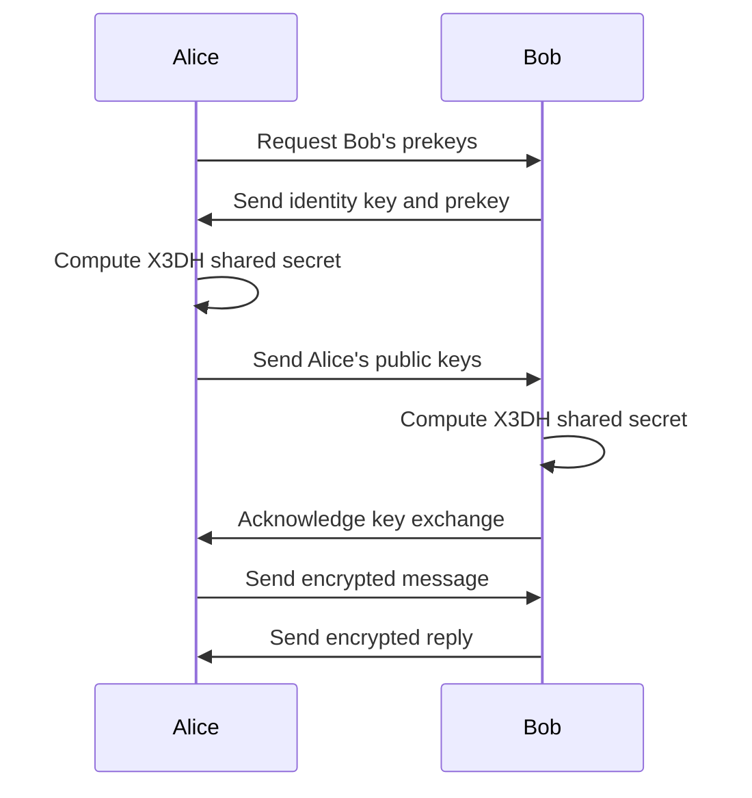

# Secure X3DH Chat Application 🔐


A secure end-to-end encrypted chat implementation using the Extended Triple Diffie-Hellman (X3DH) key agreement protocol and Double Ratchet algorithm in Python.

## Table of Contents
- [Features](#features)
- [Cryptographic Overview](#cryptographic-overview)
- [Installation](#installation)
- [Usage](#usage)

## Features

- **X3DH Protocol** for secure initial key exchange
- **Double Ratchet Algorithm** for forward secrecy
- **Perfect Forward Secrecy** with message-specific keys
- **AES-256-GCM** authenticated encryption
- **Two-way asynchronous communication**
- **Console-based interface** with colored output

## Cryptographic Overview



## Installation

### Prerequisites
- Python 3.8+
- pip package manager

### Setup
Clone the repository:

```bash
git clone https://github.com/kreloaded/x3dh-chat.git
cd x3dh-chat
```

### Install dependencies:
```bash
pip install -r requirements.txt
```

### Create environment file:

```bash
cp sample.env .env
```

## Usage

### Start the Server (Terminal 1)
```bash
python server.py
```

### Start Bob (Terminal 2)
```bash
python bob.py
```

### Start Alice (Terminal 3)
```bash
python alice.py
```